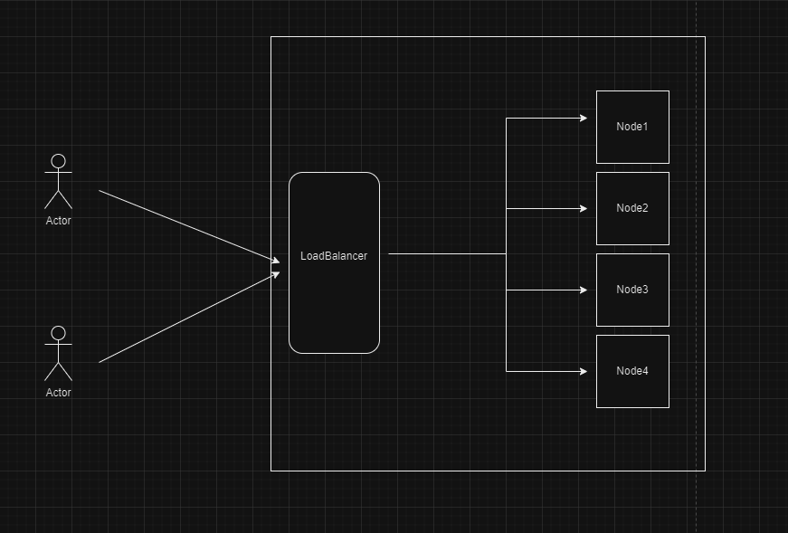

# Load Balancer Project

## Overview

This project is a simple load balancer that distributes HTTP requests to multiple backend servers. It uses a round-robin method by default but can switch to other methods like random selection. It handles multiple requests at the same time and allows adding or removing backend servers dynamically.


## Features
Round-Robin and Random Selection: Supports different ways to distribute requests.
Dynamic Server Management: Add or remove servers without restarting.
Handles Multiple Requests: Efficiently processes many requests at once.
Error Management: Handles failed requests and other errors.
Monitoring and Debugging: Tools to monitor and debug the load balancer.

## Prerequisites

- Java 11 or higher
- Maven
- Spring Boot

## Setup Instructions

### 1. Build the Project
Use Maven to build the project:
```sh
mvn clean install
```
### 2. Run the Application
Start the application using Spring Boot:
The application will start on http://localhost:8081.

Do the above steps for server1, server2, server3 to start the backend servers. 
```sh
mvn clean install
mvn spring-boot:run
```
The 3 servers with start on 
1. Server 1 : http://localhost:8082.
2. Server 2 : http://localhost:8083.
3. Server 3 : http://localhost:8084.


### 4. Endpoints

## Load Balancer Endpoints
- #### 1. Forward Request
    GET /api/loadbalancer/forward
    
    Forwards the request to the next available backend server as per the strategy assigned.
    
    Response:
    
    200 OK: Request successfully forwarded to the backend server.

- #### 2. Add Backend Server
    POST /api/loadbalancer/addServer
    
    Adds a new backend server.
    
    Request Body: {
  "url": "http://localhost:8085"
  }
    
    Response:
    200 OK: Server added successfully.


- #### 3. Remove Backend Server
    DELETE /loadbalancer/removeServer
    
    Removes an existing backend server.
    
    Request Body:{
  "url": "http://localhost:8085"
  }
    
    Response:
    
    200 OK: Server removed successfully.

- #### 4. Set Load Balancing Strategy
    POST /loadbalancer/setStrategy
    
    Sets the load balancing strategy.
    
    Parameters:
    strategy: roundrobin or random

    Response:
    200 OK: Load balancing strategy set successfully.
    400 Bad Request: Invalid strategy specified.
    ````
    curl -X POST http://localhost:8081/loadbalancer/setStrategy?strategy=random
    ````

### Low-Level Design

#### Components

- **Client Request**: A client sends a request to the `/forward` endpoint.
- **LoadBalancerController**: Receives the request and calls `LoadBalancerService.getNextServer()`.
- **LoadBalancerService**: Uses the current load balancing strategy to select a backend server.
- **LoadBalancingStrategy**: Implements the algorithm (e.g., Round Robin or Random) to select a server from the list.
- **BackendServer**: The selected server processes the request and returns the response to the client.

```
### High-Level Design



### 7. How to scale
The current implementation can be extended or scaled in several ways:

1.  Add More Strategies: You can add more load balancing strategies by creating more classes that implement the `LoadBalancingStrategy` interface. For example, you could create a `LeastConnectionsStrategy` that selects the server with the fewest active connections.

2.  Add More Servers: You can add more servers to the load balancer by adding more URLs to the `servers` map in the `LoadBalancer` constructor.

3.  Handle Failures: The current implementation does not handle failures. If a server goes down while processing a request, the request will fail. You could add error handling code to retry the request on a different server if the first attempt fails.

4.  Scale Horizontally: You can run multiple instances of the load balancer behind a reverse proxy to handle more traffic. The reverse proxy would distribute incoming requests among the load balancer instances, and each load balancer instance would distribute its requests among its servers.


